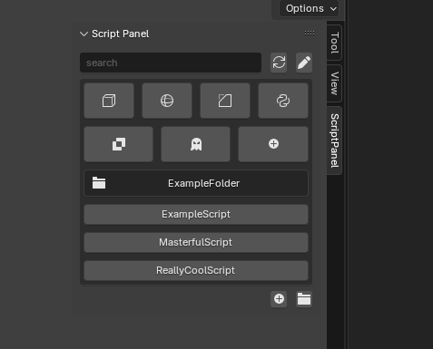
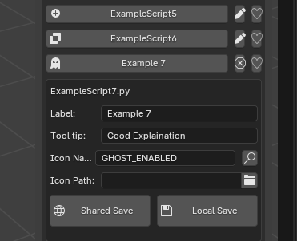

# Script Panel for Blender

[Script Panel](https://github.com/rBrenick/script-panel) rewritten from the ground up for Blender.

## Example UI

Designed to be used in a studio environment for sharing simple scripts between artists. Any python files added to one of the defined root paths automatically shows up as a button in the UI.

Inspiration from [brave rabbits' toolShelf](https://www.braverabbit.com/braverabbit/tools/toolshelf/) but with a slightly different flavor to it.

## Button customization options

#### Icons

- Search and pick from existing blender icons
- Or make your own .png to use

### Configs
The button customizations can be saved to a `shared_config.json` or `local_config.json`

- `shared_config` is meant to be distributed to everyone.

- `local_config` is applied on top of the shared config. Meant for more opionated customization.

## General customization options

